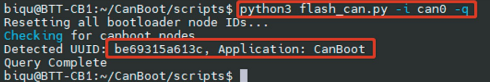

#### Page Sections:
-MMBv1.1:
  - [Flashing Katapult onto MMBv1.1](#---flashing-katapult-for-mmbv11)
  - [Compiling Klipper for MMBv1.1](#---compiling-klipper-firmware-for-mmbv11)
  - [Flashing Klipper onto MMBv1.1 using Katapult](#---firmware-update-via-katapult-for-mmbv11)
  - [Flashing Klipper onto MMBv1.1 using USB (DFU Mode)](#---firmware-update-via-usb-dfu-mode-for-mmbv11)
-MMBv2.0:
  - [Flashing Katapult onto MMBv2.0](#)
  - [Compiling Klipper for MMBv2.0](#)
  - [Flashing Klipper onto MMBv2.0 using Katapult](#)
  - [Flashing Klipper onto MMBv2.0 using USB (DFU Mode)](#)


These instructions were copied from the manuals provided by BTT and updated as necessary.
> [!NOTE] 
> These instructions assume you already have CAN communication working on your printer (unless you're using a USB connection). If you don't, check out [Esoterical's CANBus Guide](https://canbus.esoterical.online/).

##    Flashing Katapult for MMBv1.1
> [!NOTE] 
> Note: Katapult (formerly CanBoot) is for updating MCU firmware directly via CAN bus. If you prefer to update via USB (DFU Mode), skip this entire section.

To flash Katapult onto Raspberry Pi or CB1, follow the instructions at https://github.com/Arksine/katapult

1. Connect to CB1/Raspberry Pi via SSH and enter the command `cd ~`.
Navigate to the main directory and input `git clone https://github.com/Arksine/katapult` to download the Katapult project. Then enter `cd katapult` to navigate to the Katapult directory.

2. Enter `make menuconfig` and configure as shown in the provided image:


3. Use the command `make` to compile the firmware. The resulting katapult.bin file will be in the home/username/katapult/out folder. This can be directly downloaded to your computer from the SSH software's left panel.


4. Hold the Boot button and connect the board to Raspberry Pi/CB1 via Type-C cable to enter DFU mode.

5. Enter `lsusb` in the SSH terminal to query the DFU device ID.


6. Enter the following command to flash Katapult
`make flash FLASH_DEVICE=0483:df11`
replacing `0483:df11` with the actual device ID found in the previous step.

7. After flashing, disconnect the Type-C cable.


##    Compiling Klipper Firmware for MMBv1.1

1. Connect to CB1/Raspberry Pi via SSH and enter the following commands:
`cd ~/klipper/`
`make menuconfig`

Configure the firmware as shown in the provided image (update Klipper firmware to the latest version if options are not available).


```yml
[*] Enable extra low-level configuration optionsMicro-controller
 Micro-controller Architecture (STMicroelectronics STM32) --->
 Processor model (STM32G0B1) --->
```

If not using Katapult:

`Bootloader offset (No bootloader) --->`

If using Katapult:

`Bootloader offset (8KiB bootloader) --->`

If USB communication on Type-C is used:

`Communication interface (USB (on PA11/PA12)) --->`

If CAN-Bus communication is used:

```yml
Communication interface (CAN bus (on PB0/PB1)) --->
(1000000) CAN bus speed
```

2. After configuration, press `q` to exit, and select `Yes` when prompted to save.

3. Enter `make` to compile the firmware. The resulting `klipper.bin` file will be in the `home/username/klipper/out` folder. This can be directly downloaded to your computer from the SSH software's left panel.


##    Firmware Update via Katapult for MMBv1.1

1. Connect the CAN bus cable and plug a jumper at the 120R terminal resistor.

2. Enter the command `cd ~/katapult/scripts` then enter `python3 flash_can.py -i can0 -q`
This will query the canbus ID (make sure the CAN cable is connected and powered on) as shown in the figure below, the UUID of the device has been found:



3. Enter `python3 flash_can.py -i can0 -f ~/klipper/out/klipper.bin -u be69315a613c`

> [!NOTE] 
> Note: Replace `be69315a613c` with the actual device UUID found in the previous step.

klipper.bin needs to be generated in advance using the `make` command, and the application start offset of CanBoot is 8KiB offset, so Klipper's menuconfig Bootloader offset should also be 8KiB bootloader as shown in the following figure.


4. Query again with `python3 flash_can.py -i can0 -q`
The Application should now show Klipper, indicating it is running correctly.


##    Firmware Update via USB (DFU Mode) for MMBv1.1

Guide to update Raspberry Pi / CB1 / primary MCU via DFU.

1. Hold the Boot button and connect the MMB to Raspberry Pi/CB1 via Type-C cable to enter DFU mode.

2. Enter `lsusb` in the SSH terminal to query the DFU device ID.


3. Enter `cd klipper` to navigate to the Klipper directory, and enter:

`make flash FLASH_DEVICE=0483:df11`

> [!NOTE] 
> Note: Replace `0483:df11` with the actual device ID found in the previous step.

This will start flashing the firmware.

4. After flashing, enter `ls /dev/serial/by-id/` to query the device's Serial ID (only applicable for USB communication, not for CANBus).

5. If you are using USB communication, you don't need to press the Boot button for subsequent updates. You can enter the following command to flash the firmware:

`make flash FLASH_DEVICE=/dev/serial/by-id/usb-Klipper_stm32g0b1xx_4550357128922FC8-if00`

> [!NOTE] 
>  replace `/dev/serial/by-id/xxx` with the actual ID found in the previous step.

6. If you are using CAN bus for communication, disconnect the Type-C cable after flashing.

<br />

### More essential config setup:
- [Basic Operation](https://github.com/Enraged-Rabbit-Community/ERCFv2.5/blob/main/Documentation/Basic-Operation.md)
- [Hardware Configuration](https://github.com/Enraged-Rabbit-Community/ERCFv2.5/blob/main/Documentation/Hardware-Configuration.md)
- [MMU Calibration](https://github.com/Enraged-Rabbit-Community/ERCFv2.5/blob/main/Documentation/MMU-Calibration.md)
- [Setup Calibration](https://github.com/Enraged-Rabbit-Community/ERCFv2.5/blob/main/Documentation/Setup_Calibration.md)
- [Slicer Setup](https://github.com/Enraged-Rabbit-Community/ERCFv2.5/blob/main/Documentation/Slicer-Setup.md)
- [Endstops, Movement and Homing](https://github.com/Enraged-Rabbit-Community/ERCFv2.5/blob/main/Documentation/Movement-and-Homing.md)
- [Happy Hare Parameters](https://github.com/Enraged-Rabbit-Community/ERCFv2.5/blob/main/Documentation/Happy-Hare-Parameters.md)
- [Macro Configuration](https://github.com/Enraged-Rabbit-Community/ERCFv2.5/blob/main/Documentation/Macro-Configuration.md)