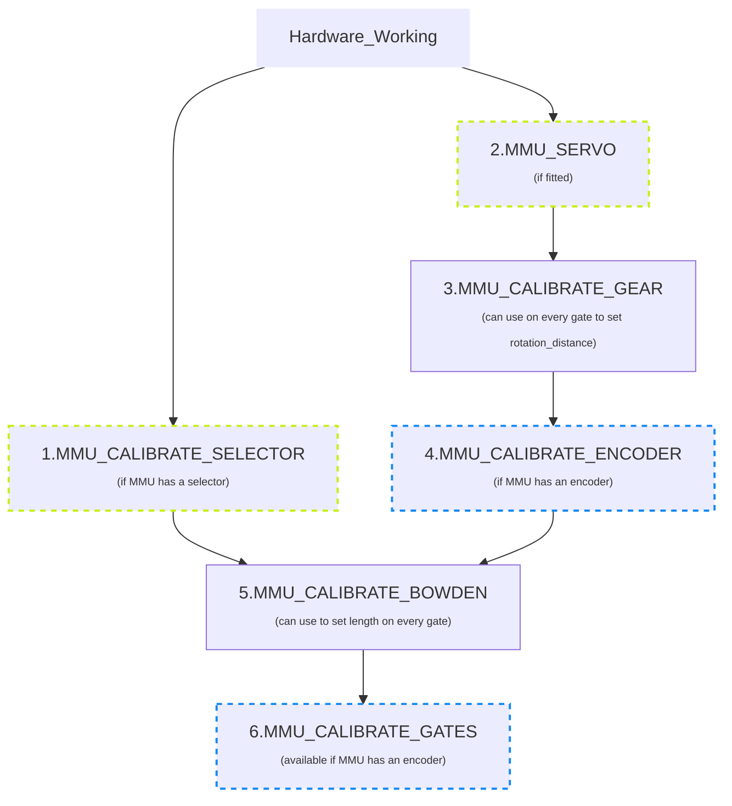
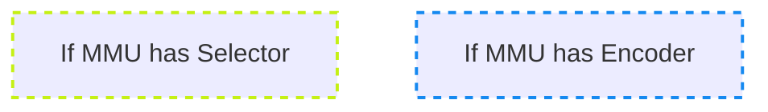

#### Page Sections:
- [Calibration Steps](#---calibration-steps)
  - [1. Selector Offsets](#---step-1-calibrate-selector-offsets)
  - [2. Servo](#---step-2-calibrate-your-servo)
  - [3. Gear Stepper](#---step-3-calibrate-your-gear-stepper)
  - [4. Encoder](#---step-4-calibrate-your-encoder-if-fitted)
  - [5. Bowden Length](#---step-5-calibrate-bowden-length)
  - [6. Gates](#---step-6-calibrating-individual-gates)
- [Calibration Storage](#---calibration-storage)
- [Calibration Commands](https://github.com/moggieuk/Happy-Hare/wiki/Command-Reference#---calibration)

This discussion assumes that you have setup and debugged your hardware configuration. A detailed discusion can be found under [Hardware Configuration](Hardware-Configuration.md).

Before using your MMU you will need to calibrate it to adjust for differences in components used on your particular build. Be careful to calibrate in the recommended order because some settings build and depend on earlier ones. Happy Hare now has automated calibration for some of the traditionally longer steps and does not require any Klipper restarts so the process is quick and painless.

<br>

##    Calibration Steps

> [!IMPORTANT]  
> When calibrating the first time you must perform in the prescribed order.  Once complete you can re-calibrate particular steps but remember that some calibration changes will cascade.  E.g. after calibrating the gear, you must recalibrate the encoder, the bowden and possibly all the gates.  Generally you can re-calibrate the selector (step 1) and the gates (step 5) at any time, but the gear, encoder and bowden must always be done in that order!


<!--

-->
- MMU designs with disimilar `rotation_distance` on each gate require separate measured calibration of each with `MMU_CALIBRATE_GEAR` or, if an encoder is fitted, with `MMU_CALIBRATE_GATES` to automate the process. This is important even if the drive gears look similar. Tradrack is an example of a design that doesn't require this.
- Most MMU designs will share the same bowden length (and only one need be calibrated), however if the design can have different lenghts each must be calibrated separately.

<br>

> [!TIP] 
> All of the calibration commands can be run in a "check/test" mode. Simply add `SAVE=0` to the command and the calibration will be run but the results will not be saved. This is very useful to practice or to verify calibration

<br>

###    Step 1. Calibrate selector offsets
Only application to MMU's with linear selector: **E.g ERCF, Tradrack**

#### A) Fully automatic calibration
Let's start by getting the selector cailbrated in this easy step (it is important to do this early because the bowden and gate calibration need to be able to select gates).  This sets up the position all of all the gates as well as the bypass position if fitted.  Firstly ensure MMU motors are off by running `MMU_MOTORS_OFF` and remove filament from gate #0 -- you may need to run `MMU_SERVO POS=up` to release the filament.  Then re-insert and remove filament through selector to ensure that gate #0 is correctly alined with selector. Be careful and move the selector side to side whilst moving the filament inside the gate. Try to assess where the filament is centered in the gate and leave the selector in that position. Then run:

  > MMU_CALIBRATE_SELECTOR

Sit back and relax. The selector will move to find the extremes of movement and then use information about the geometry of the particular MMU and version/options you are using to generate and save the selector offsets automatically!

> [!NOTE]  
> (i) ERCF v1.1 users need to pay particular attention to letter suffixes after the version number in `mmu_parameters.cfg`<br>
> (ii) ERCF v1.1 users that are using a bypass block modification also need to specify the position of that block with `BYPASS_BLOCK=` (see command reference) to indicate which bearing block contains the bypass.

<br>

#### B) Extrapolate first and last gates
Although the above automated method above will attempt to calibrate when the selector has no deterministic hard stop at limit at travel (Tradrack) it can result in drift unless all the gates/lanes are perfectly tight together. To address this a better method that can be used with Tradrack or any MMU design with equally spaced gates (e.g. ERCF v2) is as follows:
```yml
MMU_MOTORS_OFF
  # Use a piece of filament to align gate 0; remove filament
MMU_CALIBRATE_SELECTOR GATE=0
MMU_MOTORS_OFF
  # Use a pieve of filament to align the last gate; remove filament
MMU_CALIBRATE_SELECTOR GATE=n
  # (where n is the last gate number, remember we are 0 based)
```
This will automatically set the offset of all intermediate gates distributing any build variance

<br>

#### C) Individual gate calibration
Although it should not be necessary other than for the bypass gate, there is an option update a single position if you would like to tune or run into problems. See the command reference for more detailed information on options, but basically you turn MMU motors off, line up the desired gate with the selector and run:

  > MMU_CALIBRATE_SELECTOR SINGLE=1 GATE=...

Strictly speaking `SINGLE=1` is only required if calibrating just your final gate to avoid automatic extrapolation.

#### D) Individual bypass gate calibration
Similar to the above if your MMU has a bypass gate you can calibrate it's position by aligning the selector and running:

  > MMU_CALIBRATE_SELECTOR BYPASS=1

**Validation:** At the end of this step you should be able to select any tool/gate on your MMU. For instance, try running `MMU_HOME TOOL=3` to re-home and select tool/gate #3.

<br>

###    Step 2. Calibrate your servo
Only applicable to MMU's with linear selector: **E.g ERCF, Tradrack**

Happy Hare sets up theoretically good servo postions during installation, however they really should be calibrated. Most MMU's require precise servo movement. To do that you need to run through this process similar to this to update and record the angle for the three symbolic positions. Be sure to consult you MMU documentation.

```yml
MMU_SERVO POS=up
  # Assume the position isn't quite right
MMU_SERVO
Current servo angle: 125, Positions: {'down': 110, 'up': 125, 'move': 110}
  # Without arguments you can view the current angles
MMU_SERVO ANGLE=128
  # Tweak until you are happy with position
MMU_SERVO POS=up SAVE=1
  # Save the current angle (128) for the "up" position
```

Repeat for the three positions:
* up   = tool is selected and filament is allowed to freely move through gate
* down = to grip filament
* move = ready the servo for selector move (optional - defaults to up)

> [!NOTE]  
> Refer to you specific MMU doc for information to determine exactly what servo positions are required.<br>
> If you are unsure that your MMU requires a "move" position, set it the same as "up"<br>
> If you are unable to attain the servo angle required you might need to "change spline" or edit the servo configuration in `mmu_hardware.cfg`<br>
> 
> **Example servo positions on ERCF MMU design**<br>
> Ignore this if not on an ERCF, but this might be helpful to many users. Make sure the 3 position of your servo arm so the arm does not hit the tophats when the selector is moving. See picture below to find out where the position should be for the 3 positions.
> - Servo Up. (trap released / print without sync)
> <p align="center"></p>
>
> - Servo Move. (trap locked / selector movement)
> <p align="center"></p>
>
> - Servo Down. (trap released for Load/unload or print with sync mode)
> <p align="center"></p>

<br>

###    Step 3. Calibrate your gear stepper
Applicable to all MMU's: **Very important to get right!**

In this step you are simply ensuring that when the gear stepper is told to move 100mm of filament it really does move 100mm.  It is akin to what you did when you set up your extruder rotational distance although in this case no Klipper restart is necessary!  Select gate #0 (you can use `MMU_SELECT GATE=0` if you have finished the selector calibration above) and put some filament through the gate so that it pokes out just past the selector exit.  Run the following to ensure the filament is gripped if your MMU needs to actuate a servo to grip filament:

  > MMU_SERVO POS=down

Next remove the bowden tube and cut the filament flush with the ECAS connector at the output of the MMU (e.g the encoder on the ERCF design). Run this command to attemp to move 100mm of filament:

  > MMU_TEST_MOVE MOVE=100

Get out your ruler and very carefully measure the length of the emited filament.  Hold your ruler up to the bowden and gently pull the filament straight to get an accurate measurement. Next run this specifying your actual measured value (102.5 used in this example):

  > MMU_CALIBRATE_GEAR MEASURED=102.5

```
    Gear stepper 'rotation_distance' calculated to be 23.117387 (currently: 22.9)
    Gear calibration for gate 0 has been saved
```

> [!NOTE]  
> You can also measure over a different length by using something like `MMU_TEST_MOVE MOVE=200` and `MMU_CALIBRATE_GEAR LENGTH=200 MEASURED=205.25` for a 200mm length for example.

**Validation:** If you want to test, snip the filament again flush with the ECAS connector and run `MMU_TEST_MOVE`.  Exactly 100mm should be moved this time.

Repeat for all other gates if your MMU has variable gears (not necessary on Tradrack). However if you have an encoder you can shortcut and use `MMU_CALIBRATE_GATES` discussed later.

<br>

###    Step 4. Calibrate your encoder
Applicable if fitted: **All ERCF, Tradrack Binky Mod, etc**

If your MMU includes an encoder (like the ERCF design) the next step is to calibrate so it measures distance accurately. Re-fit the bowden to the selector/encoder (you can insert the short length of filament to tube as you fit to save time). Alternatively, just make sure you have some filament at gate #0 before starting. Now run:

  > MMU_CALIBRATE_ENCODER

You will see an output similar to:

```
    Calibrating over 400mm...
      + counts: 368
      - counts: 368
      + counts: 369
      - counts: 369
      + counts: 369
      - counts: 369
    Load direction:   mean=368.67 stdev=0.58 min=368 max=369 range=1
    Unload direction: mean=368.67 stdev=0.58 min=368 max=369 range=1
    Before calibration measured length: 394.47mm
    Calculated resolution of the encoder: 1.085049 (currently: 1.094543)
    Encoder calibration has been saved
```

> [!NOTE]  
> (i) Use fresh filament - grooves from previous passes through extruder gears can lead to slight count differences.<br>
> (ii) Make sure the selector is aligned with the gate. If it is off to one side you will almost certainly get disimilar counts in forward and reverse directions.<br>
> (iii) You want the counts on each attempt to be the same or very similar but don't sweat +/-3 counts.  With ERCF v2.0, sprung servo and new Binky encoder design they should be very consistent though ;-)<br>
> (iv) You can run this (like all calibration commands) without saving the result by adding a `SAVE=0` flag.

If this step worked then you should be able to unload the residual filament with `MMU_UNLOAD`. If you aren't happy with results, leave the filament ready for the next run.

<br>

###    Step 5. Calibrate bowden length
Applicable to MMU's with fast bowden move: **Most designs except Angry Beaver**

The last calibration before use! Here you can calibrate the length of your bowden from MMU gate to extruder entrance. This is important because it allows the MMU to move the filament at a fast pace over this distance because getting to the more complicated part of the load sequence. To speed up this process and depending on what sensors you have fitted for extruder homing, you may need to give the calibration routine a hint of how far way the extruder is.

There are different ways to do this depending on your configuration and sensor options:

1. If `extruder_homing_endstop: extruder` (or `mmu_gear_touch` or `filament_compression`), then you have a homing endstop and you can simply specify a `BOWDEN_LENGTH` that is GREATER than your estimated length to give plenty of room to find the homing stop (technically, Happy Hare defaults to 2000mm so you can probably omit this parameter completely).
<br>(**This is the method for most newer (type-B) MMU designs**)

  > MMU_CALIBRATE_BOWDEN<br>
  > MMU_CALIBRATE_BOWDEN BOWDEN_LENGTH=1500


2. If `extruder_homing_endstop: collision` (and you are relying on an encoder), then during Bowden calibration `BOWDEN_LENGTH` needs to be supplied and MUST be slightly shorter than the actual length. A good rule of thumb is to manually measure the distance from exit from the selector to the entrance to your extruder. Subtract 40-50mm from that distance. I measured approximately 690mm on my system, so will supply 650mm as the starting value. For example:
<br>(**This is the method for non modified ERCF design**)

  > MMU_CALIBRATE_BOWDEN BOWDEN_LENGTH=650

```
    Homing MMU...
    Tool T0 enabled
    Calibrating bowden length from reference Gate #0
    Tool T0 enabled
    Heating extruder to minimum temp (200.0)
    Finding extruder gear position (try #1 of 3)...
    Pass #1: Filament homed to extruder, encoder measured 683.5mm, filament sprung back 3.2mm
    - Bowden calibration based on this pass is 683.5
    Finding extruder gear position (try #2 of 3)...
    Pass #2: Filament homed to extruder, encoder measured 682.7mm, filament sprung back 3.2mm
    - Bowden calibration based on this pass is 682.7
    Finding extruder gear position (try #3 of 3)...
    Pass #3: Filament homed to extruder, encoder measured 683.9mm, filament sprung back 3.2mm
    - Bowden calibration based on this pass is 683.4
    Recommended calibration reference is 680.2mm. Clog detection length: 16.8mm
    Bowden calibration and clog detection length have been saved
```

3. Finally, if you run into problems or don't have an encoder or homing sensor or have problems with collision detection at the extruder you can run manually. To do this, select gate 0, push filament through manually all the way to the extruder gears. This run with the `MANUAL=1` option. This will measure the distance in reverse to the gate homing position:
<br>(**This is the method for MMU designs like Tradrack that don't have encoder but do have `mmu_gate` sensor**)

  > MMU_CALIBRATE_BOWDEN BOWDEN_LENGTH=1000 MANUAL=1

This will reverse homes to the gate and uses Klipper's measurement of stepper movement.

> [!NOTE]  
> (i) This calibration assumes that the selector has been calibrated first.<br>
> (ii) This may cause the extruder to be heated. This is to ensure that the extruder motor is energized and can resist the impact of the collision with the filament

<br>

###    Step 6. Calibrating individual gates
Applicable to MMU's with varible per-gate rottion distance & encoder: **ERCF, Tradrack with Binky**

This step allows for calibrating slight differences between gates and saves you from having to use `MMU_CALIBRATE_GEAR` on every gate.  It isn't required (or useful) for designs that cannot have variation like the Tradrack MMU but is useful for designs like ERCF that can have variation of feed between gates.  Even with ERCF this is optional because if not run, the gates will tune themselves as they are used automatically!  That said it be beneficial to get this out of the way with a test piece of filament but doing it also: (i) removes the need to set the `autotune_rotation_distance` in `mmu_parameters.cfg`, (ii) is necessary if there is substantial variation between gates -- e.g. if BMG gears for different gates are sourced from different vendors.

Simply make sure filament is available at the gate you want to calibrate -- you can hold a (500mm) loose piece of filament and run:

> MMU_CALIBRATE_GATES GATE=1

You will see an output similar to:

```
    Tool T1 enabled
    Calibrating gate 1 over 400.0mm...
      + measured: 404.4mm
      - measured: 404.4mm
      + measured: 404.4mm
      - measured: 404.4mm
      + measured: 405.5mm
      - measured: 405.5mm
    Load direction:   mean=404.7 stdev=0.63 min=404.4 max=405.5 range=1.1
    Unload direction: mean=404.7 stdev=0.63 min=404.4 max=405.5 range=1.1
    Calibration move of 6x 400.0mm, average encoder measurement: 404.7mm - Ratio is 1.011872
    Calculated gate 1 rotation_distance: 22.941324 (currently: 22.672165)
    Calibration for gate 1 has been saved
```

> [!NOTE]  
> (i) You can also quickly run through all gates (even pass the loose filament gate to gate) with `MMU_CALIBRATE_GATES ALL=1`<br>
> (ii) If you see "Calibration ignored because it is not considered valid (>20% difference from gate 0)" then it either means the calibration failed because filament was not moving or the encoder was not working correctly. Less likely but possible is because you have not calibrated gate 0 (`MMU_CALIBRATE_GEAR` and `MMU_CALIBRATE_ENCODER`) correctly which serves as the reference gate.

<br>

###    Calibration Storage
All calibrated results are stored in the configured `[save_variables]` file. By default and most usually this will be the `mmu_vars.cfg`. Here is a list of those variables and the command that sets them:

  | Variable | Command | Notes |
  | -------- | ------- | ----- |
  | mmu_selector_offsets | MMU_CALIBRATE_SLECTOR | A list of offsets for each gate of the MMU |
  | mmu_selector_bypass | MMU_CALIBRATE_SELECTOR | The offset of the bypass (passthough) location |
  | mmu_servo_angles | MMU_SERVO | E.g {'down': 45, 'up': 125, 'move': 110} represents the angles for the three servo positions |
  | mmu_gear_rotation_distances | MMU_CALIBRATE_GEAR or MMU_CALIBRATE_GATES | The list represents `rotation_distance` for each gate |
  | mmu_encoder_resolution | MMU_CALIBRATE_ENCODER | The distance each encoder signal transition represents |
  | mmu_calibration_bowden_home | MMU_CALIBRATE_BOWDEN | Records the gate homing endstop used as a basis for the calibration |
  | mmu_calibration_bowden_lengths | MMU_CALIBRATE_BOWDEN | The list will be the same length as the number of gates on your MMU |
  | mmu_calibration_clog_length | MMU_CALIBRATE_BOWDEN | Only used with encoder although always set incase you add in the future |


### ERCF Setup Steps:
- [Flashing Your Local MCU](https://github.com/Enraged-Rabbit-Community/ERCFv2.5/blob/main/Documentation/Flashing-Local-MCU.md)
- [Installing Happy Hare](https://github.com/Enraged-Rabbit-Community/ERCFv2.5/blob/main/Documentation/Installing-Happy-Hare.md)
- [Happy Hare Configuration](https://github.com/Enraged-Rabbit-Community/ERCFv2.5/blob/main/Documentation/Happy-Hare-Configuration.md)
- [Calibrating Your Hardware](https://github.com/Enraged-Rabbit-Community/ERCFv2.5/blob/main/Documentation/Calibrating-Your-Hardware.md)
- [Installing KlipperScreen Happy Hare](https://github.com/Enraged-Rabbit-Community/ERCFv2.5/blob/main/Documentation/Installing-KlipperScreen.md)
- [Slicer Configuration](https://github.com/Enraged-Rabbit-Community/ERCFv2.5/blob/main/Documentation/Slicer-Setup.md)
- [Further Mods to Consider](https://github.com/Enraged-Rabbit-Community/ERCFv2.5/blob/main/Documentation/Further-Mods.md)

### Useful References:
- [Hardware Configuration](https://github.com/Enraged-Rabbit-Community/ERCFv2.5/blob/main/Documentation/Hardware-Configuration.md)
- MMU Calibration
- [Basic Operation](https://github.com/Enraged-Rabbit-Community/ERCFv2.5/blob/main/Documentation/Basic-Operation.md)
- [Setup Calibration](https://github.com/Enraged-Rabbit-Community/ERCFv2.5/blob/main/Documentation/Setup_Calibration.md)
- [Slicer Setup](https://github.com/Enraged-Rabbit-Community/ERCFv2.5/blob/main/Documentation/Slicer-Setup.md)
- [Endstops, Movement and Homing](https://github.com/Enraged-Rabbit-Community/ERCFv2.5/blob/main/Documentation/Movement-and-Homing.md)
- [Happy Hare Parameters](https://github.com/Enraged-Rabbit-Community/ERCFv2.5/blob/main/Documentation/Happy-Hare-Parameters.md)
- [Macro Configuration](https://github.com/Enraged-Rabbit-Community/ERCFv2.5/blob/main/Documentation/Macro-Configuration.md)
