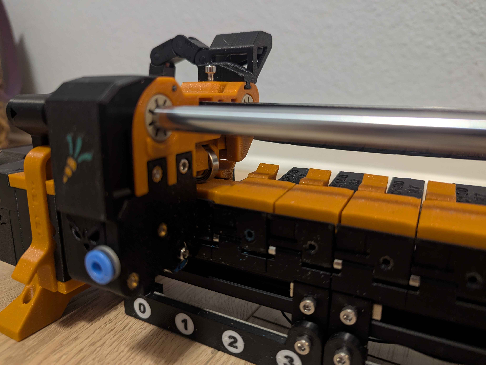
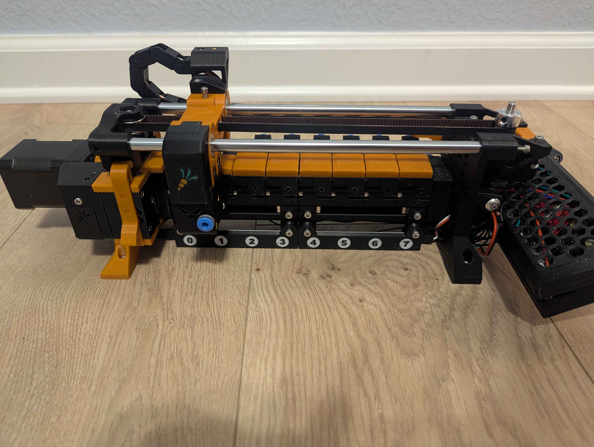
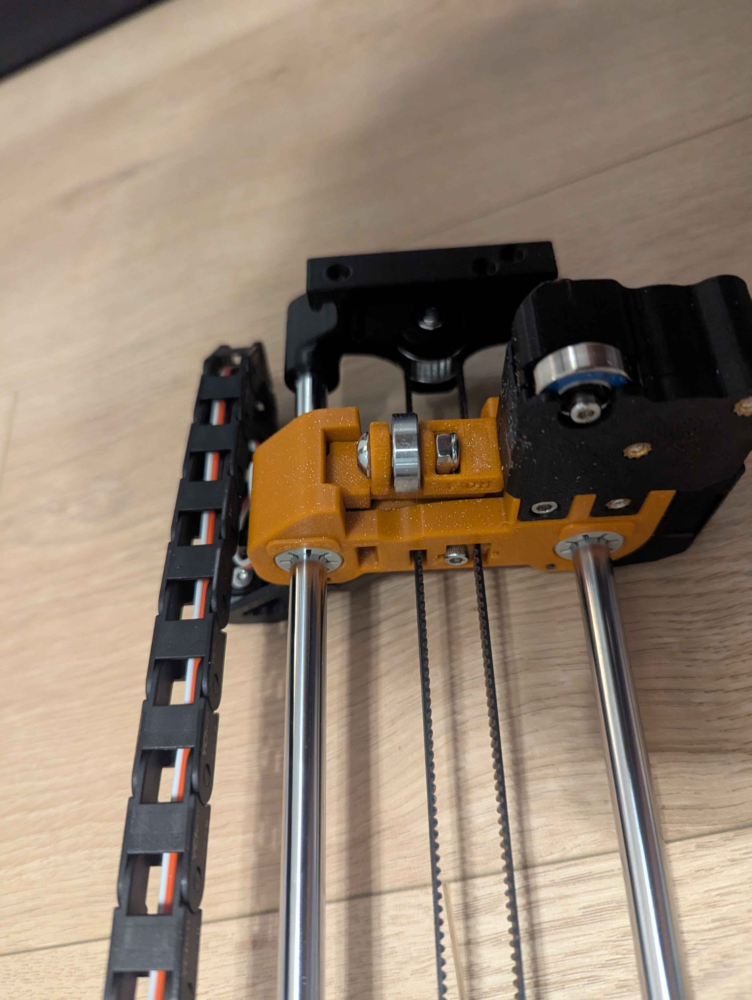
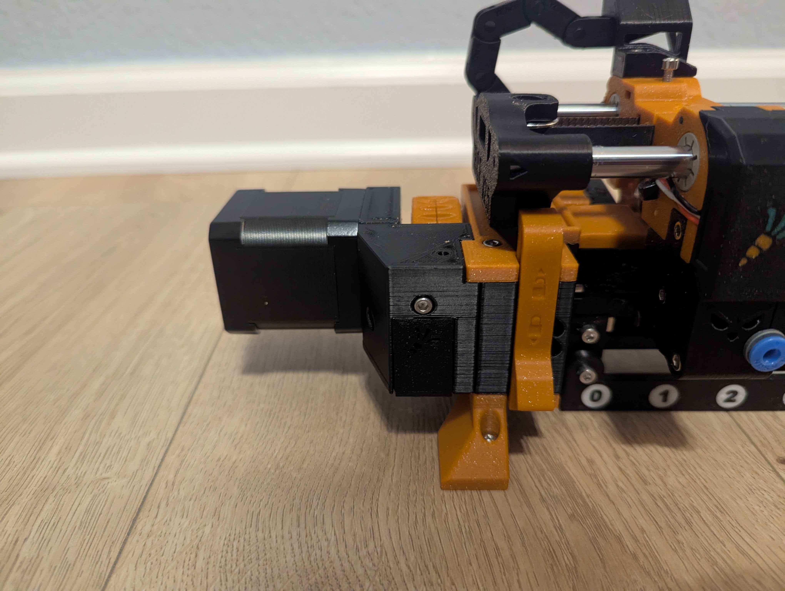
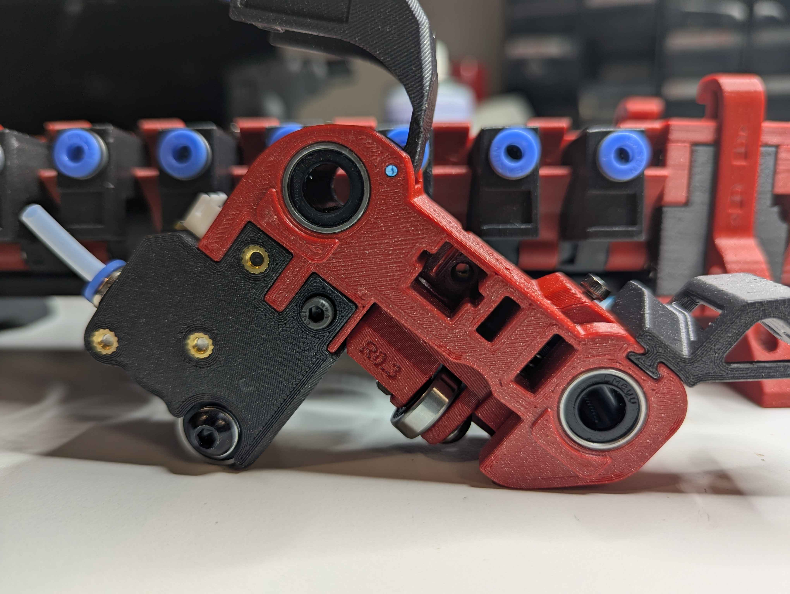
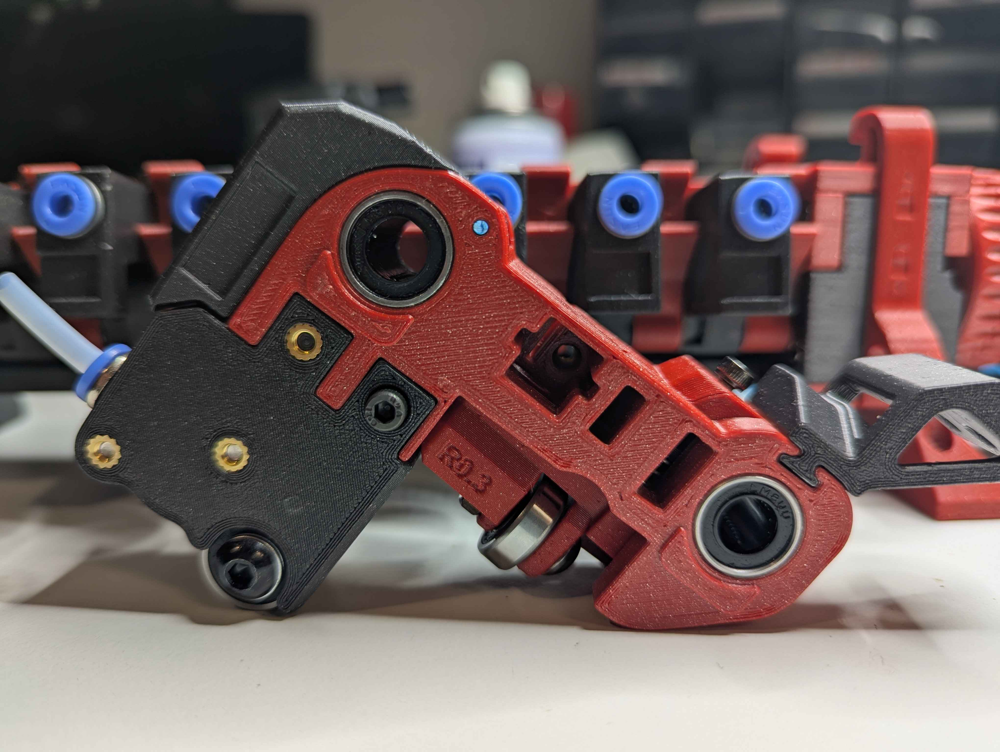
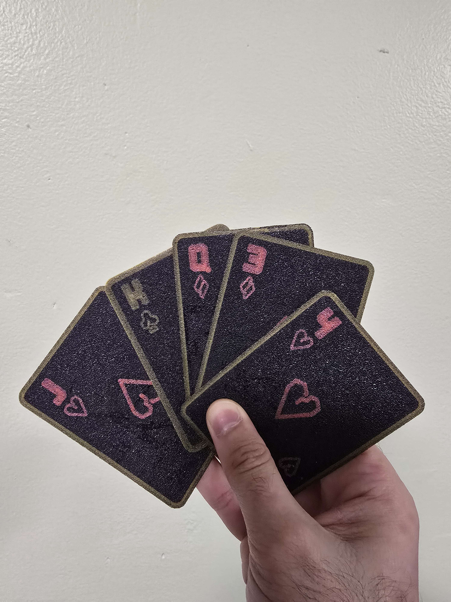
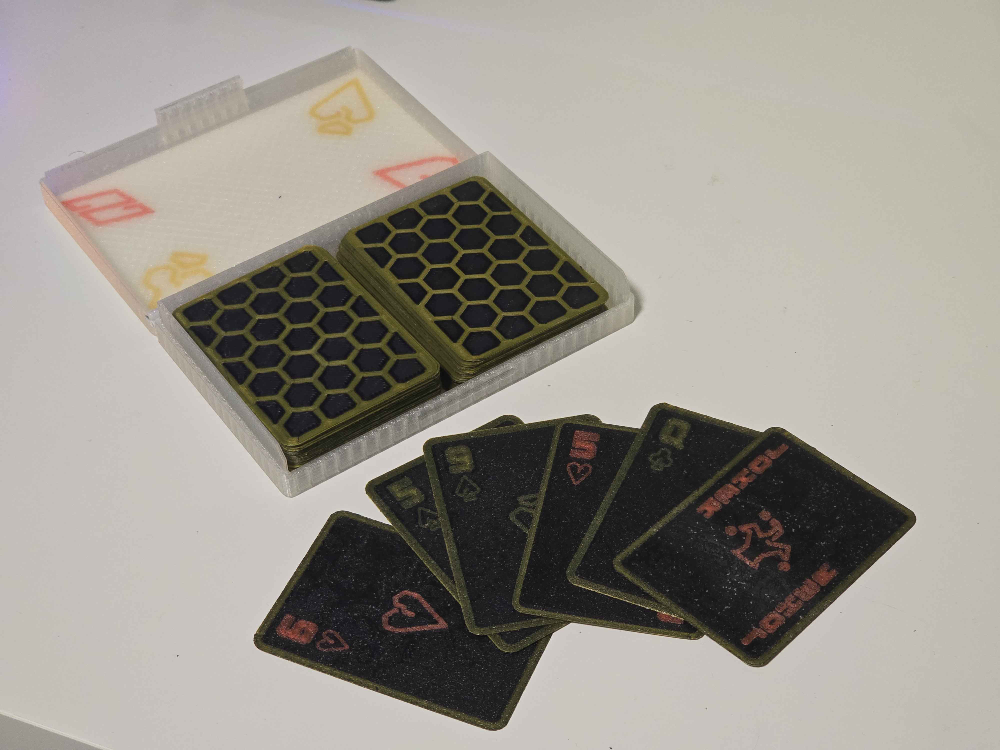

## Carrot Collective Projects

[ERCF v3](https://github.com/Carrot-collective/ERCF_v3)

[ERCT / CottonTail](https://github.com/Carrot-collective/ERCT)

[Filametrix Toolhead Cutter Buffer](https://github.com/Carrot-collective/Filametrix)

[Blobifier Purge System](https://github.com/Carrot-collective/Blobifier)

[Filamentalist Rewinder Buffer](https://github.com/Carrot-collective/Filamentalist)

### Carrot Collective Affiliates

[Jabberwocky Toolhead](https://github.com/kinematicdigit/Jabberwocky)

[Happy Hare Wiki](https://github.com/moggieuk/Happy-Hare/wiki)

 

# Enraged Rabbit Community Project

 
 <h1 align="center">ERCF v3.0</h1>

An expandable MMU for Klipper-based 3D-Printers

  &nbsp;
  &nbsp;
  &nbsp;
  &nbsp;
  &nbsp;

 

<table>
<tr>
<td width=30%></td>
<td>
This is a community-born project and a major update to the Voron ERCF MMU that was started a couple of years ago by Ette. It is endorsed by Ette, and the guiding philosophy wasn't to start again with a new MMU design but to refine what has already proven to be a very capable machine and push it to be the best it can be by simplifying problematic construction, improving reliability and aligning as close as possible to v2.0 BOM. The project includes an optional integrated filament buffer system (ERCT), filament cutter option (ERF), a collection of recommended tool head sensor modifications and a bit of Bling! It fully leverages the Happy Hare firmware MMU control software with Klipper Screen extensions.

 
There is a rapidly growing list of MMUs in the marketplace, from the mass-produced "Fords" who pioneered the market to the "Toyota" that are more recent efficient engineering feat but somehow lacked soul. We consider ERCFv3.0 the "BMW" - a little over-engineered perhaps but distinctively cool, and you feel good driving it. We hope you enjoy it!
</td>
</tr>
</table>

## Table of Content
 
**[ERCF](#enraged-rabbit-carrot-feeder-ercf)** 
**[ERCT](#-enraged-rabbit-cotton-tail-erct---filament-buffer)** 
**[ERF](#-toolhead-cutter-enraged-rabbit-filametrix-erf)** 
**[Toolhead Sensor Modifications](#-toolhead-cutter-enraged-rabbit-filametrix-erf)** 
**[Firmware](#firmware)** 
**[Documentation](#documentation)** 
**[BOM](#bom)** 
**[CAD](#cad)** 
**[FAQ](#faq)** 
**[Acknowledgements](#acknowledgements)** 
**[Vendors](#vendors)** 
**[Changelog](#changelog)** 
**[Build Photos](#build-photos)** 
**[Showroom](#user-print-showroom)** 
<!--
**[FAQ](Assets/FAQ.md)
-->

 

## Enraged Rabbit Carrot Feeder (ERCF)
<table>
<tr>
<td width=45%>An MMU or Multimaterial Unit/Upgrade allows for the automatic change of filaments on your 3D printer. You can use it to create beautiful multi-colored prints or, if you're lazy, simply to avoid loading filament by hand. If you are familiar with ERCF v1.1, this will serve as an overview of updates in v2:</td>
<td>
<ol>
 <li>Sturdy backbone - no more flex</li>
 <li>Reliable (and custom) encoder design</li>
 <li>Sprung servo instead of adjustable top hats</li>
 <li>Innovative Filament trap in blocks instead of magnetic gates</li>
 <li>Formal filament bypass</li>
 <li>Reinforced gearbox assembly</li>
 <li>Beautifully illustrated Manual</li></li>
 <li>High Quality Step-by-step CAD</li>
 <li>Integrated passive buffer system (Cotton Tail)</li>
 <li>Perfect tips with Filametrix Filament cutter</li>
 <li>Functional and aesthetic LED status indication</li>
</ol>
</td>
</tr>
</table>
New features in v3.0 include:
<ol>
 <li>New Direct Drive motor system optimized for torque and ease of use</li>
 <li>Redesigned Gearbox that supports legacy gearing options for upgraders</li>
 <li>Redesigned high-constraint filament blocks with pregate sensors as a default option</li>
 <li>Many Quality of Life additions such as improved Encoder and Selector Cart</li>
 <li>optional microswitch PCBs which allow solderless installation</li>
 <li>optional LED PCBs which allow solderless installation</li>
 <li>Detailed MMB v1.1 and v2.0 wiring diagrams</li>
 <li>Software Setup Documentation for the most popular boards</li>
 <li>Proper GitHub sections for User Mods, Mounting, and PCBs for the community to build upon</li>
 <li>Electronics boxes for the most popular boards: MMBv1 and v2, EasyBRD, ERB*</li>
</ol>

*The ERB is not recommended for use without an additional external 5v power supply.
 

## Optional Enraged Rabbit Components

The ERCF ecosystem includes several options to allow you to customize to your specific needs:

#### Filament Buffer/Rewinder Systems
When an MMU changes tool, the unloaded filament needs to be thoughtfully managed so that it doesn't tangle. The ERCF project provides two such systems. The best choice for you will depend on your specific setup:

 

###  Enraged Rabbit Cotton Tail (ERCT) - Filament Buffer
<table>
<tr>
<td width=30%></td>
<td>
The Enraged Rabbit Cotton Tail (ERCT) buffer system is designed to attach directly to ERCF v3.0. It is a passive system that optimizes space and is also designed to reduce resistance in the filament path, creating a consistent system for calibration.

ERCT includes a pre-gate filament sensor for automated filament loading and detect runout for endless spool feature. It also incorporates a NEOpixel on each gate that, when driven by the Happy Hare firmware, provides functional feedback and the necessary "bling!"

ERCT is a very compact and integrated buffer system that is great when your spools are remote from your printer.

[Read more](https://github.com/Carrot-collective/ERCT) &nbsp;&nbsp; Videos: [Rear Loading](https://youtu.be/9jzB5Un6HKo) [Front Loading](https://youtu.be/GlSXtUkd-b8)
</td>
</tr>
</table>

 

###  Enraged Rabbit Filamentalist - Filament Rewinder
<table>
<tr>
<td>
The Enraged Rabbit Filamentalist is an combined solution for buffering AND spool holder and thus provides total space savings. Rather than containing the unwound coils of filament it instead rewinds the filament back onto the spool which means there are never loose filament coils to tangle.

Filamentalist requires no additional motors because of its innovation of using the gear stepper of the MMU coupled through the filament to power both feeding and rewinding the spool. This can help overcome friction but caution is recommended for really soft TPU.

Filamentalist can also use the modular pre-gate filament sensor and gate entry LED blocks from ERCT so you don't give up on bling!

[Read more](https://github.com/Carrot-collective/Filamentalist)
</td>
<td width=30%></td>
</tr>
</table>

 

###  Toolhead Cutter: Enraged Rabbit Filametrix (ERF)
<table>
<tr>
<td width=30%></td>
<td>
Before the MMU can unload a filament, the tip must be prepared so that it can be cleanly loaded next time. This tip-forming process is very difficult to tune and varies based on material type, temperature, hotend type and even weather! Introducing Enraged Rabbit Filametrix (ERF) filament cutting system. This lightweight addition to your Stealthburner toolhead adds a cutting blade. When retracting, the problematic tip of the filament is simply cut off for perfect tips and no jams.

ERF also supports an optional servo operated ganrtry activation pin so no print area is lost with this addition. ERF designs also include the recommended integrated toolhead sensor

[Read more](https://github.com/Carrot-collective/Filametrix)
</td>
</tr>
</table>

 

###  Toolhead Sensor Modifications
<table>
<tr>
<td>
ERCF can be operated without a toolhead sensor (filament detection) in the toolhead but it is **not recommended**. A toolhead sensor provides an accurate homing point very close to the nozzle but also adds reliability to the tool change process. ERCF includes a set of toolhead sensor modifications for popular extruders. These work reliably through coupling a microswitch to the filament path.

[Read more](Recommended_Options/Toolhead_Modifications/README.md)
</td>
</tr>
</table>

 

### Purge System (Blobifier)
<table>
<tr>
<td width=30%></td>
<td>

The Blobifier is a small device that eliminates the need for a purgeblock, making filament swaps quicker. It does this by extruding filament onto a tray creating a blob that will get ejected into a purge-bucket. 

<h3>Features</h3>

- Turn your filament purge into blobs for less waste and quicker purging. 
- Store the blobs in a bucket that can hold 400 blobs! 
- Automatically pause the printer once the bucket is full. 
- Detect when the bucket is installed or missing. 
- Shake the bucket for better dispersion of the blobs in the bucket. 
- Clean your nozzle on a brass brush before resuming to print. 

[Read More](https://github.com/Carrot-collective/Blobifier)

</td>
</tr>
</table>

 

## Firmware
<table>
<tr>
<td width=30%></td>
<td>
ERCF is designed to be used with the Happy Hare MMU firmware for Klipper which adds a set of klipper extensions for configuration setup, testing and operation of ERCF. These commands are available through the command line or macros but are perhaps best operated with an interactive UI with the optional KlipperScreen extension.

Happy Hare provides an easy installation script which has knowledge of recommended settings and will greatly accelerate the setup process.

[Happy Hare](https://github.com/moggieuk/Happy-Hare/wiki) &nbsp;&nbsp; [KlipperScreen HH Edition](https://github.com/moggieuk/KlipperScreen-Happy-Hare-Edition)
</td>
</tr>
</table>

 

## Documentation
<table>
<tr>
<td>
Building something as complex as an MMU is a challenging undertaking, but the ERCFv3.0 project contains an amazingly detailed and illustrated manual with step-by-step instructions. We have tried to make the process similar to fitting together a jigsaw puzzle, albeit with a few optional pieces.

[Documentation](Documentation)
[ERCFv3.0 PDF Manual](Documentation/ERCF_v3_Manual.pdf)
</td>
<td width=30%></td>
</tr>
</table>

 

## BOM
<table>
<tr>
<td width=30%></td>
<td>
You can find a Bill of Materials (BOM) and a convenient printed parts tracker for the project and options here. Note that the BOM also contains an upgrade list for those of you who want to use your existing ERCF v1.1 kits. Please make a copy and edit the "Filament Blocks #" to be the number of gates for your build. This can be any number, but we encourage kit vendors to use 4/8/12 as size variations. Note that there are separate columns for core ERCF, the optional ERCT and ERF options, as well as the suggested "extras"

Please be aware that the BOM is strictly for reference. The recommended parts can be exchanged for other similar quality parts. Manufacturers who use the BOM as a reference must submit an application for certification before selling them as ERCF v3.0 kits. Please contact us for certification.

[BOM](https://docs.google.com/spreadsheets/d/1UV0rU5Eo4hZX6hcIlSMzn-18oxGSBlLzFjurV6kf8oU/edit?usp=sharing) &nbsp;&nbsp; [Printed Parts Tracker](https://docs.google.com/spreadsheets/d/1MnmpiGlzxnq3sh8Gv73tNb6P1GbJ26OSJ0_e25pumdo/edit?usp=sharing)
</td>
</tr>
</table>

 

## CAD
<table>
<tr>
<td>
A lot of work has gone into creating a quality CAD model of the project, carefully organized into folders that match the documentation! It is highly recommended that you open the CAD and hide every folder and then expose them one at a time as you work through the build.

[Master CAD](CAD)
</td>
<td width=30%></td>
</tr>
</table>

 

## FAQ
ERCF v3 is currently at the fourth iteration or v3.0 phase. Design evolution has required some BOM changes over v2.0. We're sure there will be lots of questions. To avoid repetition on the various support channels, you can find a list of [frequently asked questions](FAQ.md) here. If something isn't answered the best place to go is the primary [ERCF Discord Server](https://discord.com/channels/1267663557999329371/1310278996503826585)

 

## Acknowledgements
Most importantly let me introduce the development, test and doc team. A project like this doesn't happen without many hundreds of hours of volunteer effort and all of these folks are truely awesome. Please give some :clap: :clap: :clap:
<ul>
 <li>@Miriax (Designer & Doc Demon)
 <li>@kinematicdigit VS.744 (Mr Cotton Tail & Doc Illustrator)
 <li>@ningpj (Tester, Breaker & Documenter)
 <li>@SkiBikeMake (Mr Filamentalist)
 <li>@moggieuk V0.1503 | v3.4088 (Mr Happy Hare)
 <li>@gneu v3.0345 (Filament block & bling innovator)
 <li>@sneakytreesnake v3.3804 (The project backbone!)
 <li>@mneuhaus VT.483 (Mr Binky)
 <li>@fizzy (King of CAD)
 <li>@gsx8299 (Test Builder Extraordinaire)
 <li>@sorted (Filametrix "don't get enraged" filament cutting system)
 <li>@kierantheman (Mr ThumperBlocks)
 <li>@Fragmon (Videographer)
 <li>@Silverback v3.1356 (Filametrix tester, builder & engineer)
</ul>

 

## Vendors
<table>
<tr>
<td width=25%></td>
<td>
These kits and specialty parts will have been checked by us and meet good quality standards. Pending Certification means it has met our first pass inspection and in the process of being verified as a v3 kit. <strong>WE DO NOT RECOMMEND PURCHASING KITS WITHOUT THE CERTIFICATION BY US. PLEASE CHECK BACK HERE FOR THE LIST OF AUTHORIZED VENDORS AND MANUFACTURERS</strong>: 

<ul>
 <li> Pending Submission - Siboor
 </li>
 <li> Pending Submission - Triangle Labs
 </li>
 <li> Pending Submission - Seleadlabs
 </li>
 <li> Pending Submission - Makerpanda
 </li>
 <li> Pending Submission - Fysetc
 </li>
 <li> Pending Submission - Dodo 3D Labs
 </li>
 
 
  
 

 A list of more official and certified vendors is on the way... stay tuned!
</td>
</tr>
</table>

**Manufacturers:**
_If you want to be included, please contact us. We are happy to validate your kit/parts and then add you to the list._

 

## Changelog
<ul>
 <li>v3.0 - Full Release</li>
 <li>v2.0 - Full Release (Happy Easter!)
 <li>v2 RC1 - Initial Release (Happy Christmas!)
</ul>

CAD Design Guidelines used in this project (in case you were interested) can be found: [here](/Assets/Dev_Notes.md).

<i>
There once was a printer so keen, 
To print in red, yellow, and green. 
It whirred and it spun, 
Mixing colors for fun, 
The most vibrant prints ever seen!
</i>

 

## Build Photos

Click to enlarge.

 

## User Print Showroom

Click to enlarge.

  
