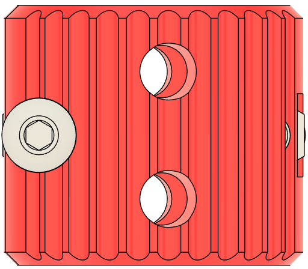
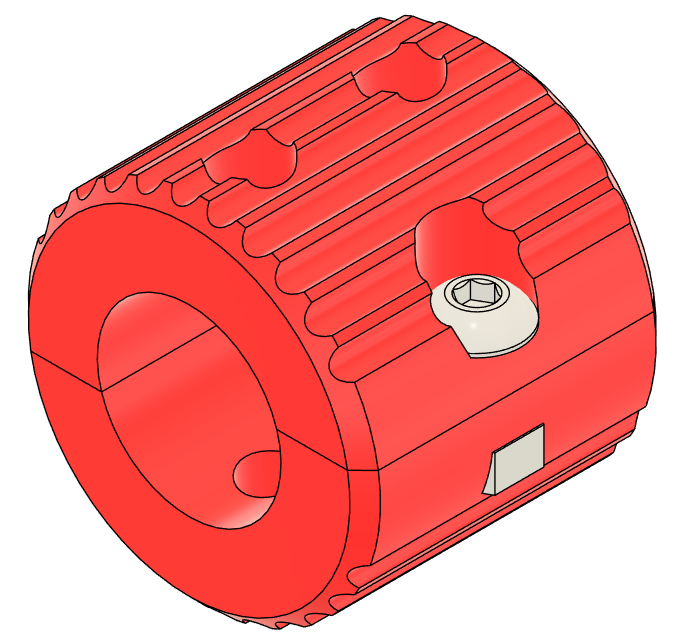
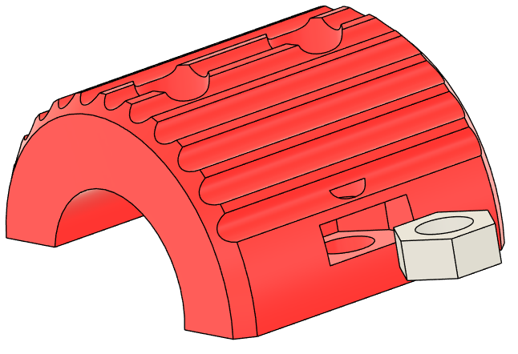
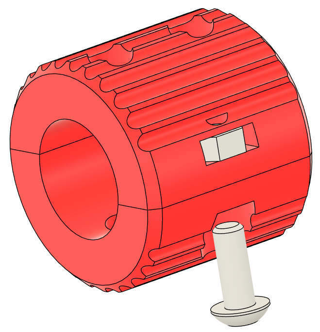

# Metal Coupler Sleeve

Uses 5mm ID "rigid shaft coupling," 20mm long, 12mm diameter, threaded for M4. If you can find one threaded for M3, let me know!

[Amazon.co.jp Link](https://www.amazon.co.jp/dp/B0BZS6CTPC)

[AliExpress Link](https://www.aliexpress.us/item/3256804476993285.html)

[Amazon US Link](https://www.amazon.com/dp/B08V8H721N)

# Print Settings

As normal. Supports are left to the user and not built-in as normal.

# Instructions

Insert M3 nut into coupler halves

Insert M3x8mm BHCS and snug

Insert metal coupler. Align the grubscrew holes with the holes in the sleeve. Tighten the bolts, alternating until snug. This only needs to be snug enough to grip the metal coupler.
